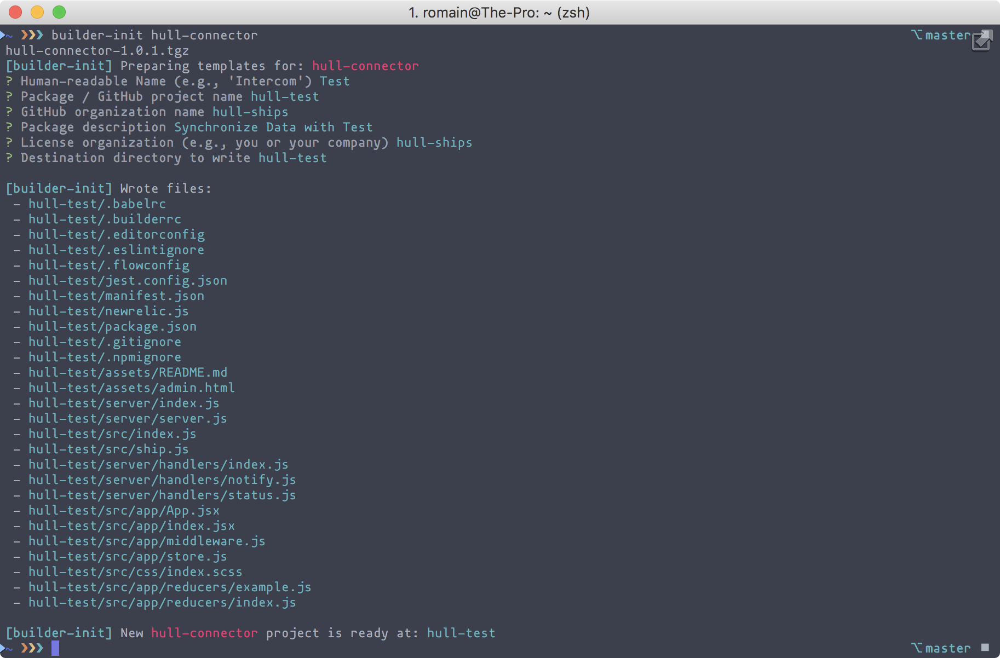

# Hull Connector Generator

We use [Builder](http://formidable.com/open-source/builder/)

## Installing

```
~/test ❯❯❯ yarn global add builder builder-init
~/test ❯❯❯ builder-init hull-connector;
```



```
hull-connector-1.0.1.tgz
[builder-init] Preparing templates for: hull-connector
? Human-readable Name (e.g., 'Intercom') Test
? Package / GitHub project name hull-test
? GitHub organization name hull-ships
? Package description Synchronize Data with Test
? License organization (e.g., you or your company) hull-ships
? Destination directory to write hull-test

[builder-init] Wrote files:
 - hull-test/.babelrc
 - hull-test/.builderrc
 - hull-test/.editorconfig
 - hull-test/.eslintignore
 - hull-test/.flowconfig
 - hull-test/jest.config.json
 - hull-test/manifest.json
 - hull-test/newrelic.js
 - hull-test/package.json
 - hull-test/.gitignore
 - hull-test/.npmignore
 - hull-test/assets/README.md
 - hull-test/assets/admin.html
 - hull-test/server/index.js
 - hull-test/server/server.js
 - hull-test/src/index.js
 - hull-test/src/ship.js
 - hull-test/server/handlers/index.js
 - hull-test/server/handlers/notify.js
 - hull-test/server/handlers/status.js
 - hull-test/src/app/App.jsx
 - hull-test/src/app/index.jsx
 - hull-test/src/app/middleware.js
 - hull-test/src/app/store.js
 - hull-test/src/css/index.scss
 - hull-test/src/app/reducers/example.js
 - hull-test/src/app/reducers/index.js

[builder-init] New hull-connector project is ready at: hull-test
```

## Usage
```
~/test ❯❯❯ cd hull-test
~/test ❯❯❯ nvm use 8
~/test ❯❯❯ yarn
~/test ❯❯❯ yarn dev   //Start development server
~/test ❯❯❯ yarn build //Build project
~/test ❯❯❯ yarn start //Start production server
```

## Developing the Archetype

```
yarn gen-dev;
npm link ; cd dev ; npm link
```

## Publishing the archetype

```
# Bump version in package.json
npm run publish:both
```

## Setup

- Will monitor, bundle and build all `.js` files in the `src` folder for Client-side code
- Will build the `server` folder as `lib` for Server-side code
